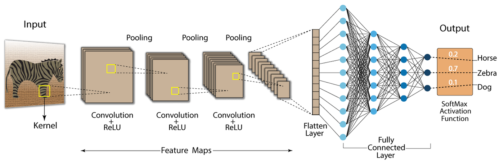
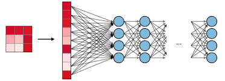
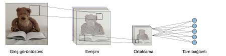

# 🧠 MNIST Rakam Sınıflandırma: Evrişimli Sinir Ağları (CNN) 🚀

Bu proje, dünyaca ünlü **MNIST** veri setini kullanarak el yazısı rakamları (0-9) %99'a varan doğrulukla tanıyan bir **Evrişimli Sinir Ağı (CNN)** modelini içermektedir.

[](https://www.tensorflow.org/)
[](https://www.python.org/)
[](https://opensource.org/licenses/MIT)

---

## 📋 Proje Genel Bakış

Derin öğrenme dünyasının "Merhaba Dünya"sı olarak kabul edilen MNIST problemi, bilgisayarlı görü (computer vision) alanındaki temel taşlardan biridir. Bu çalışmada, basit bir tam bağlantılı (Fully Connected) ağ yerine, görsellerdeki uzamsal özellikleri yakalamada çok daha başarılı olan **CNN** mimarisi tercih edilmiştir.

### 🏗️ Model Mimarisi

Modelimiz, görüntüdeki özellikleri (kenarlar, köşeler, dokular) hiyerarşik bir şekilde öğrenmek için tasarlanmıştır:

| Katman | Tip | Özellikler |
| :--- | :--- | :--- |
| **Giriş** | Input | 28x28x1 (Gri Tonlamalı Görüntü) |
| **Evrişim 1** | Conv2D | 32 Filtre (3x3), ReLU Aktivasyonu |
| **Havuzlama 1** | MaxPool2D | 2x2 Pencere |
| **Evrişim 2** | Conv2D | 64 Filtre (3x3), ReLU Aktivasyonu |
| **Havuzlama 2** | MaxPool2D | 2x2 Pencere |
| **Düzleştirme** | Flatten | 1D Vektöre Dönüştürme |
| **Yoğun 1** | Dense | 64 Nöron, ReLU |
| **Çıkış** | Dense | 10 Sınıf (0-9), Softmax |

<p align="center">
  
  <br>
  <i>Şekil 1: Örnek bir CNN Mimari İşleyişi</i>
</p>

---

## 📊 Veri Seti: MNIST

MNIST veri seti, 60.000 eğitim ve 10.000 test görüntüsünden oluşmaktadır. Her bir görüntü 28x28 piksel boyutunda, siyah-beyaz (gri tonlamalı) rakamlardır.

<p align="center">
  
  
  <br>
  <i>Şekil 2: Veri Setinden Örnek Görüntüler</i>
</p>

---

## 🚀 Başlangıç

### 🛠️ Gereksinimler

Projeyi çalıştırmak için aşağıdaki kütüphanelerin yüklü olması gerekir:

```bash
pip install tensorflow
```

### 💻 Çalıştırma

Modeli eğitmek ve test etmek için terminale şu komutu yazmanız yeterlidir:

```bash
python mnist_cnn.py
```

---

## 📈 Sonuçlar

Eğitim süreci sonunda elde edilen performans göstergeleri:
- **Doğruluk (Accuracy):** ~ %98-99
- **Kayıp (Loss):** < 0.05
- **Eğitim Süresi:** Modern bir işlemci/GPU ile saniyeler içinde tamamlanır.

---

## 🤝 Katkıda Bulunma

Her türlü iyileştirme önerisine ve hata bildirimine açığım! Lütfen bir `Pull Request` açmaktan veya `Issue` oluşturmaktan çekinmeyin.

---

## 📜 Lisans

Bu proje **MIT Lisansı** altında lisanslanmıştır. Daha fazla bilgi için `LICENSE` dosyasına (varsa) göz atabilirsiniz.

---
<p align="center">
  Geliştiren: <b>Hilmi Kılavuz</b> ✨
</p>
