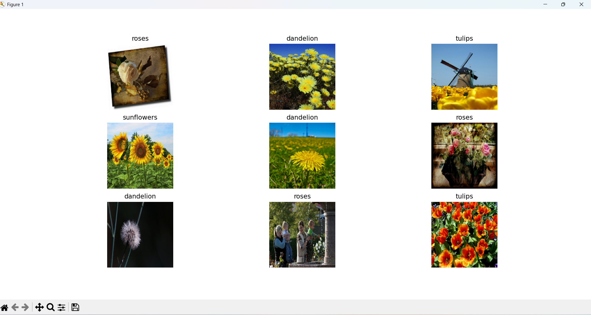

# 🌻 Çiçek Türleri Sınıflandırma (TensorFlow Flowers CNN)

Bu projede, TensorFlow veri kaynağından indirilen binlerce çiçek fotoğrafı (papatya, karahindiba, gül, ayçiçeği, lale) kullanılarak, farklı çiçek türlerini ayırt edebilen Evrişimli Sinir Ağlarına (CNN) dayalı bir Yapay Zeka modeli tasarlanmıştır.

## 📝 İçerik ve Adımlar

1. **Verilerin Okunması ve İşlenmesi:** 
   * `tf.keras.utils.image_dataset_from_directory` kullanılarak veri seti sistem klasöründen başarıyla modele uygun bir formatta yüklenir (`batch_size=32`, `180x180` çözünürlük).
2. **Performans Ayarlamaları:**
   * GPU ve işlemci tarafında yavaşlamayı engellemek adına `AUTOTUNE`, `cache()` ve `prefetch()` kullanılarak pipeline optimize edilmiştir.
3. **Modelin Oluşturulması:**
   * Öncelikle görüntü renk değerlerini [0,1] aralığına sıkıştıran `Rescaling` işlemi yapılmıştır.
   * `Conv2D` ile özellikleri çıkaran 3 farklı katman ve bu katmanların hemen sonrasında boyutları küçülten `MaxPooling2D` kullanılmıştır.
   * Son aşamada ise `Dense` layer yardımıyla özellikler sınıflandırma etiketine dönüştürülür.
4. **Eğitim:**
   * Model **Adam Optimizer** kullanılarak toplam 10 epoch süresince eğitilir.

## 📊 Örnek Görseller ve Çıktılar

Aşağıda veri setinin içerisinde barındırdığı çiçek örneklerine ait önizlemeler ve modelin epoch'lar içerisindeki doğruluk/kayıp grafikleri bulunmaktadır.

### 🌸 Veri Kümesi Örnekleri


### 📈 Doğruluk ve Kayıp (Accuracy & Loss) Grafikleri
Model eğitildiği süre boyunca hem eğitim veri seti üzerinden hem de "validation" veri seti üzerinden test edilir. Bu değerlendirme sürecini aşağıdaki grafiklerden inceleyebilirsiniz:

**Eğitim Performansı (Accuracy)**  


**Kayıp Analizi (Loss)**  


## 🚀 Kurulum ve Başlatma
Veri seti başlangıçta otomatik olarak indirilip hazır hale getirilecektir. Uygulamayı denemek için:
```bash
python orn.py
```
