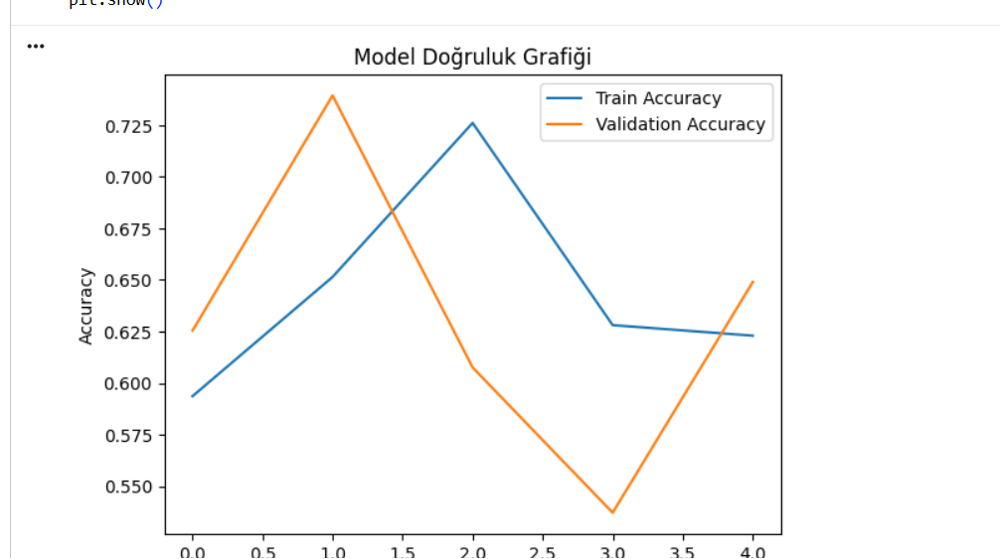
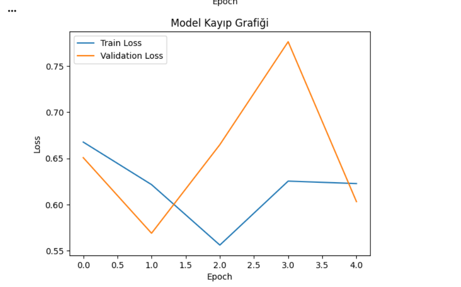
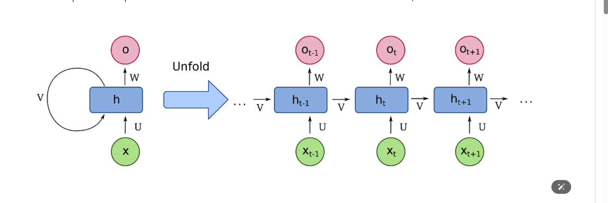

# 🎬 IMDb Duygu Analizi (Sentiment Analysis) - LSTM Modeli

Bu proje, IMDb film inceleme veri setini kullanarak metinlerin (yorumların) pozitif veya negatif olduğunu **Derin Öğrenme (Deep Learning)** yöntemlerinden olan **LSTM (Long Short-Term Memory)** ile sınıflandırmayı amaçlayan bir makine öğrenmesi uygulamasıdır.

## 📁 İçindekiler
- [Proje Amacı](#-proje-amaci)
- [Kullanılan Teknolojiler](#-kullanilan-teknolojiler)
- [Veri Seti Bilgileri](#-veri-seti-bilgileri)
- [Model Mimarisi](#-model-mimarisi)
- [Eğitim ve Performans](#-egitim-ve-performans)
- [Görseller](#-gorseller)
- [Örnek Tahmin ve Çıktılar](#-ornek-tahmin-ve-ciktilar)

## 📌 Proje Amacı
Doğal Dil İşleme (NLP) alanı kapsamında yürütülen bu proje ile, kullanıcıların filmler hakkındaki metin bazlı yorumlarını analiz edip cümlenin duygu durumunu (pozitif/negatif) tahmin etmek hedeflenmiştir. Metinlerin dizisel doğası gereği geçmiş bilgiyi hatırlamada çok başarılı olan **LSTM** derin öğrenme mimarisi tercih edilmiştir.

## 🛠 Kullanılan Teknolojiler
- **Python 3**
- **TensorFlow & Keras** (Model mimarisi ve eğitimi)
- **Matplotlib** (Sonuçların görselleştirilmesi)
- **NumPy**

## 📊 Veri Seti Bilgileri
Model, Keras içinden entegre olarak çağırılabilen geniş çaplı **IMDb Reviews Dataset** kullanılarak eğitilmiştir:
- Girdi verileri: Kelime listesi (En sık kullanılan 5.000 maksimum sözcük boyutu, `vocab_size = 5000`)
- İncelenen kelime sınırı: Her yorumun ilk 200 kelimesi (`maxlen = 200`)
- Gömme boyutu: `embedding_dim = 32`

## 🧠 Model Mimarisi
Tüm süreç **Keras Sequential API** ile inşa edilmiştir. Model genel hatlarıyla aşağıdaki katmanlardan oluşur:

1. **Embedding (Gömme) Katmanı**: Bağlamı öğrenmek için kelimeleri yoğun vektörlere (`32` boyutlu) çevirir.
2. **LSTM Katmanı**: Dizin içerisindeki sırayı ve anlamı yakalamak için **64 düğümlü (unit)** Uzun Kısa-Süreli Bellek kullanır.
3. **Dense (Sık Katman)**: Aktivasyon katmanıdır. Çıktı tek bir nörondur ve sonuç `sigmoid` aktivasyonuyla pozitif veya negatif olarak belirlenir (`0` ile `1` arası bir değer alır).

**Kayıp Fonksiyonu:** `binary_crossentropy`  
**Optimizasyon Algoritması:** `Adam`  

Ağ yapısı özet tablosunu inceleyebilirsiniz:


## 🚀 Eğitim ve Performans
- **Epoch (Eğitim Turu):** 5  
- **Batch Size:** 64  
- **Doğrulama Ayırımı (Validation Split):** %20  

Modelin test verisi üzerinde gösterdiği performans genel olarak şöyledir:
- **Test Loss:** ~0.6040  
- **Test Accuracy:** ~%64.76  

## 📉 Görseller
Modelin eğitim periyodu boyunca sergilediği başarımı ve eğitim/doğrulama kayıp fonksiyonu eğrisini aşağıdaki görsellerden inceleyebilirsiniz:

### Model Doğruluk Grafiği (Accuracy)


### Model Kayıp Grafiği (Loss)


## 💡 Örnek Tahmin ve Çıktılar
Projede örnek bir yorum verilip duygu analizi yaptırılmıştır:
```python
sample_review = "This movie was amazing! The story and acting were fantastic."

# Tahmin Sonucu
Tahmin: Negatif (olasılık: 0.4658)
```
Gelecek sürümlerde bu metin temizlik aşamalarının ve model mimarisinin detaylandırılması, hiperparametre optimizasyonu (Hyperparameter Tuning) yapılarak model başarımının (Accuracy) artırılması planlanmaktadır.
