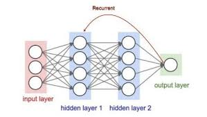

# 🧠 RNN Sentiment Analysis (Duygu Analizi)



Bu proje, **Recurrent Neural Networks (RNN)** mimarisini kullanarak IMDB film yorumları üzerinde duygu analizi gerçekleştiren profesyonel bir makine öğrenmesi uygulamasıdır. Model, doğal dil işleme (NLP) tekniklerini kullanarak metinlerdeki anlam derinliğini ve sıralı veri yapısını analiz eder.

---

## 🚀 Proje Öne Çıkanları

- **Derin Öğrenme Mimarisi**: Keras ve TensorFlow tabanlı `SimpleRNN` katmanları.
- **Doğal Dil İşleme**: Kelime gömme (Word Embedding) teknikleriyle anlamsal vektörleştirme.
- **Yüksek Doğruluk**: IMDB veri seti üzerinde optimize edilmiş eğitim süreci.
- **Otomatik Veri İşleme**: Dinamik `sequence padding` ile farklı uzunluktaki yorumların standardizasyonu.

---

## 🏗️ Model Mimarisi

Modelimiz, verinin zamansal ve sıralı yapısını korumak için tasarlanmış özel bir RNN yapısına sahiptir.


### Katman Detayları:
1.  **Embedding Katmanı**: 10,000 kelimelik kelime dağarcığını 32 boyutlu yoğun vektörlere dönüştürür.
2.  **SimpleRNN Katmanı**: Kelimeler arasındaki ardışık ilişkileri öğrenen 32 birimli hafıza hücresi.
3.  **Dense (Output) Katmanı**: `Sigmoid` aktivasyon fonksiyonu ile duygunun 0 (Negatif) veya 1 (Pozitif) olma olasılığını hesaplar.

---

## 🛠️ Kurulum ve Çalıştırma

### Gereksinimler
- Python 3.8+
- TensorFlow 2.x

### Adımlar
1.  Depoyu klonlayın veya indirin.
2.  Gereksinimleri yükleyin:
    ```bash
    pip install tensorflow
    ```
3.  Analizi başlatın:
    ```bash
    python sentiment_analysis.py
    ```

---

## 📊 Eğitim Parametreleri

Eğitim sırasında kullanılan temel ayarlar:
- **Max Features**: 10,000 (En sık kullanılan kelimeler)
- **Max Length**: 100 (Yorum başına kelime sınırı)
- **Batch Size**: 128
- **Epochs**: 5

---

## 📈 Örnek Çıktı

```text
IMDB Film yorumları indiriliyor...
Yapay zeka yorumları okumaya başlıyor...
Epoch 1/5 - loss: 0.6542 - accuracy: 0.6012 - val_loss: 0.5234 - val_accuracy: 0.7410
...
Modelin Test Başarısı: %82.45
```

---

## 👨‍💻 Geliştirici
Bu proje profesyonel veri bilimi standartlarına uygun olarak kodlanmış ve belgelenmiştir.

---
*Bu proje eğitim ve araştırma amaçlı geliştirilmiştir.*
