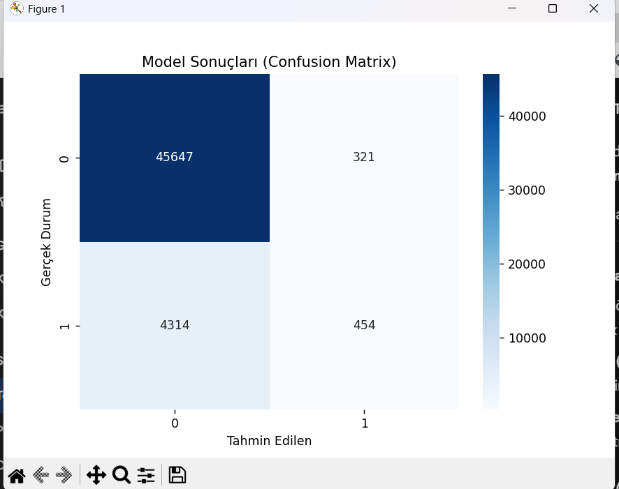
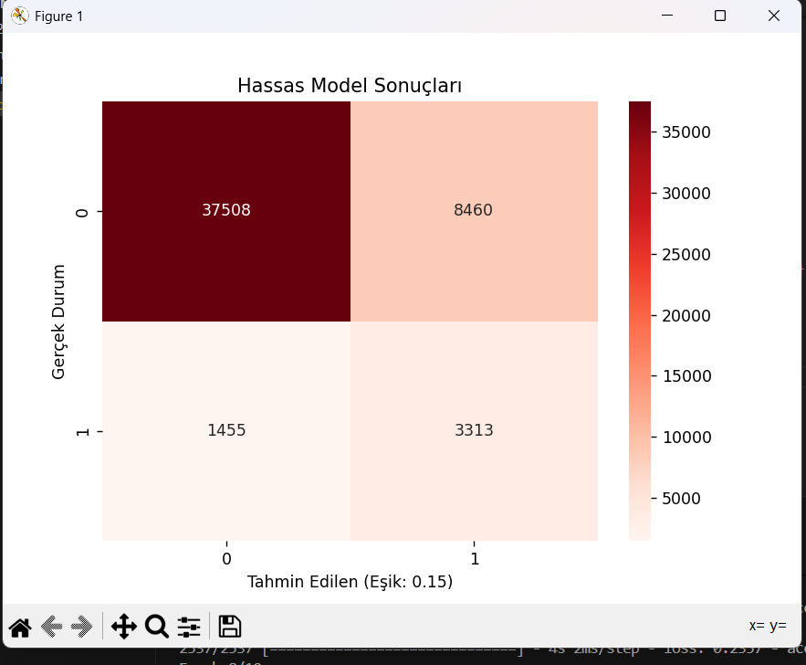

# 🫀 Kalp Hastalığı Risk Analizi (Keras Functional API)

Bu proje, Keras **Functional API** kullanarak kalp hastalığı riskini tahmin eden gelişmiş bir derin öğrenme modelidir. Model, özellikle tıbbi teşhislerde kritik öneme sahip olan **Recall (Duyarlılık)** değerini maksimize etmek için özel bir eşik değeri ayarı (**Threshold Tuning**) içermektedir.

## 🚀 Proje Hakkında

Bu çalışmada, BRFSS 2015 veriseti kullanılarak kişilerin yaşam tarzı ve sağlık göstergelerine dayanarak kalp hastalığı riski analizi yapılmaktadır. Projenin temel amacı, sadece yüksek doğruluk (accuracy) elde etmek değil, aynı zamanda hastalık riski taşıyan kişileri kaçırmamak (Yüksek Recall) üzerine kurgulanmıştır.

### 🏗️ Model Mimarisi (Functional API)

Model, Keras'ın esnek **Functional API** yapısı kullanılarak inşa edilmiştir. Standart `Sequential` modellerin aksine, bu mimari şu avantajları sunar:
- **Artık Bağlantılar (Skip Connections):** Derin katmanlarda bilgi kaybını (vanishing gradient) önlemek için giriş değerleri sonraki katmanlara doğrudan eklenmiştir.
- **Esneklik:** İleride çoklu giriş veya çoklu çıkış yapılarına kolayca adapte edilebilir.
- **Batch Normalization & Dropout:** Modelin genelleme yeteneğini artırmak ve aşırı öğrenmeyi (overfitting) engellemek için kullanılmıştır.

---

## 📊 Threshold Tuning (Eşik Ayarı)

Derin öğrenme modelleri genellikle varsayılan olarak **0.50** eşik değerini kullanır. Ancak, sağlık sektöründe "hastalığı bildirmemek" (False Negative), "yanlış alarm vermekten" (False Positive) çok daha risklidir.

Bu projede:
- **Eşik Değeri:** `0.15` olarak güncellenmiştir.
- **Neden?** Daha düşük bir eşik değeri, modelin hastalık ihtimaline karşı daha "hassas" (sensitive) olmasını sağlar. Bu sayede **Recall** oranı artırılarak, gerçek hastaların tespit edilme olasılığı yükseltilmiştir.


*Şekil 1: 0.15 eşik değeri ile elde edilen Karmaşıklık Matrisi. Düşük eşik sayesinde kaçırılan vaka sayısı minimize edilmiştir.*

---

## 📈 Performans Analizi

Modelin eğitim ve test süreçlerinden elde edilen temel metrikler aşağıdadır:


*Şekil 2: Modelin sınıflandırma raporu ve performans çıktıları.*

---

## 💻 Etkileşimli Risk Simülatörü

Proje içerisinde yer alan `manuel_risk_testi()` fonksiyonu, kullanıcıdan gerçek zamanlı veriler alarak bir risk analizi gerçekleştirir.

**Örnek Kullanım:**
1. Yüksek Tansiyon Durumu
2. BMI (Vücut Kitle Endeksi)
3. Sigara Kullanımı
4. Yaş, Cinsiyet vb. bilgiler...


*Şekil 3: Kullanıcı girişi sonrası üretilen olasılık bazlı risk raporu örneği.*

---

## 🛠️ Kurulum ve Kullanım

1. Gerekli kütüphaneleri yükleyin:
   ```bash
   pip install tensorflow pandas scikit-learn matplotlib seaborn
   ```
2. Ana betiği çalıştırın:
   ```bash
   python src/heart_disease_prediction.py
   ```

---

## 📂 Dosya Yapısı

- `src/heart_disease_prediction.py`: Ana model eğitimi ve simülasyon kodu.
- `data/heart_disease_data.csv`: Veriseti.
- `images/confusion_matrix.png`: Modelin hata analizi görseli.
- `images/model_performance_metrics.png`: Başarı metrikleri görseli.
- `images/risk_simulation_output.png`: İnteraktif simülatör ekran görüntüsü.

---
*Geliştiren: [Oğulcan Narin]*
