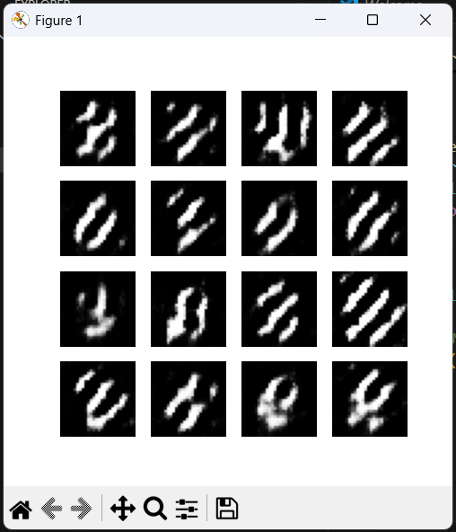
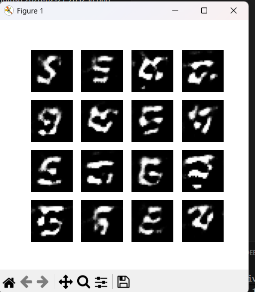
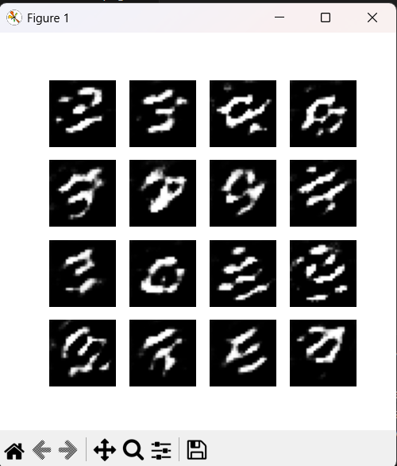
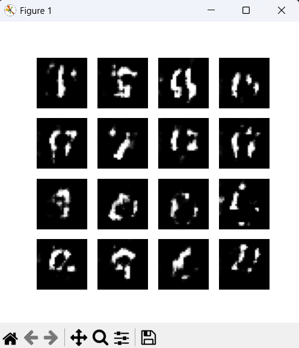
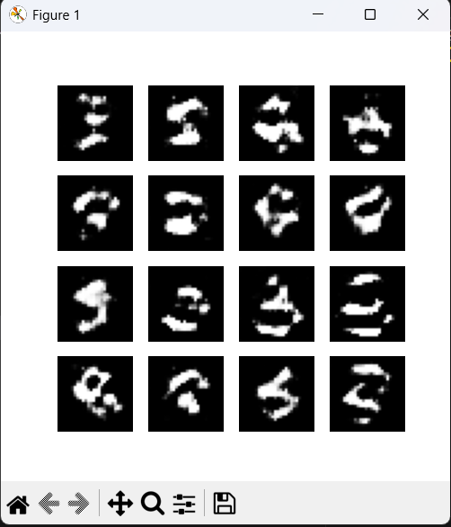
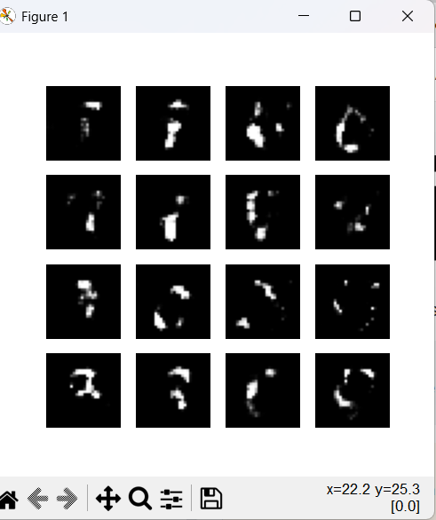

# Generative Adversarial Networks (GANs) - DCGAN ile MNIST Projesi 🧠🎨

Bu proje, TensorFlow ve Keras kullanılarak **Generative Adversarial Networks (Üretici Çekişmeli Ağlar - GAN)** mimarisiyle MNIST el yazısı rakam veri setinden yeni rakam görüntüleri üretmeyi amaçlayan bir çalışmadır. Klasik bir DCGAN (Deep Convolutional GAN) yapısı kurulmuştur.

---

## 📖 GAN Nedir ve Nasıl Çalışır?
GAN'ler, birbirinden farklı iki yapay sinir ağının birbiriyle rekabet ettiği bir mimaridir:
1. **Generator (Üretici):** Rastgele gürültüden (noise) gerçeğe çok benzeyen sahte (fake) veriler üretmeye çalışır. "Kalpazan" gibi davranır.
2. **Discriminator (Ayırt Edici):** Kendisine sunulan verinin gerçek veri setinden mi yoksa Generator tarafından mı üretildiğini anlamaya çalışır. "Dedektif" gibi davranır.

İkisi birbirine karşı bir makine öğrenimi oyunu (minimax oyunu) oynayarak gelişirler!


---

## ⚙️ Veri Hazırlama (MNIST Dataset)

Kodumuzda, `tf.keras.datasets.mnist` kullanılarak MNIST veri seti yüklenmektedir. Görüntüler model eğitimi için hazırlanmaktadır ve pikseller `[-1, 1]` aralığına normalize edilmektedir:

```python
(train_images, _), (_, _) = tf.keras.datasets.mnist.load_data()
train_images = train_images.reshape(train_images.shape[0], 28, 28, 1).astype('float32')
train_images = (train_images - 127.5) / 127.5 # Normalizasyon
```


---

## 🎨 Generator (Üretici) Modeli

Generator modeli, `100` boyutlu rastgele gürültüyü (noise) girdi olarak alır ve ardışık evrişimli devrik (Conv2DTranspose) katmanlarıyla `28x28x1` boyutlarında bir resme dönüştürür.
Kullanılan katmanlar:
- `Dense`
- `BatchNormalization`
- `LeakyReLU`
- Çıkışta ise `tanh` aktivasyon fonksiyonu kullanılmıştır.




---

## ⚔️ Discriminator (Ayırt Edici) Modeli

Discriminator, gelen resmin sahte mi yoksa gerçek mi olduğunu sınıflandıran bir Konvolüsyonel Sinir Ağı'dır (CNN). Çift adımlı (`strides=(2, 2)`) `Conv2D` katmanları ve aşırı öğrenmeyi (overfitting) engelleyen `Dropout` içerir. Girdisi `28x28x1` boyutlarındadır, çıktısı ise resmin gerçek (1) veya sahte (0) olduğuna dair bir karardır.




---

## 🧠 Kayıp (Loss) Fonksiyonları ve Optimize Ediciler

GAN modellerinde kayıp hesaplamaları modelin başarısı için kritik öneme sahiptir:
- **Discriminator Loss:** Gerçek resimleri "gerçek", sahte resimleri "sahte" olarak tahmin edebilme başarısıdır.
- **Generator Loss:** Discriminator'ı başarıyla kandırabilme, yani ürettiği sahte resimlerin "gerçek" olarak etiketlenmesini sağlama başarısıdır.

Her iki ağ için de `Adam` optimizer (öğrenme katsayısı = `1e-4`) kullanılarak eş zamanlı gradient güncellemeleri yapılır.




---

## 🌀 Eğitim Akışı ve Döngüsü (Training Loop)

Her epoch boyunca:
1. Generator'a rastgele gürültü verilir ve sahte resimler üretilir.
2. Hem sahte hem de gerçek resimler Discriminator'a verilir.
3. Gradyanlar hesaplanır ve güncellenir. 
Kodda `@tf.function` dekoratörü kullanılarak eğitim adımlarının performansı artırılmıştır. 
Örnek olarak `BATCH_SIZE = 256` ve `EPOCHS = 50` kullanılmıştır.




---

## 🎬 Sonuçları Görselleştirme ve İzleme

Eğitim sürecinde `generate_and_save_images` fonksiyonu aracılığıyla modelin gelişimi adım adım kaydedilmektedir. Model tamamen eğitildikten sonra haraketli bir GIF dosyası (`dcgan.gif`) oluşturulabilmektedir.

Aşağıda süreçten kesitler görüntülenmektedir:




---
**Not:** Bu projedeki GAN uygulaması ile MNIST veri seti kullanılarak yoktan rakam görseli oluşturabilme becerisi sergilenmektedir. 
*Proje dosyası `orn.py` üzerinden çalıştırılıp test edilebilir.*
