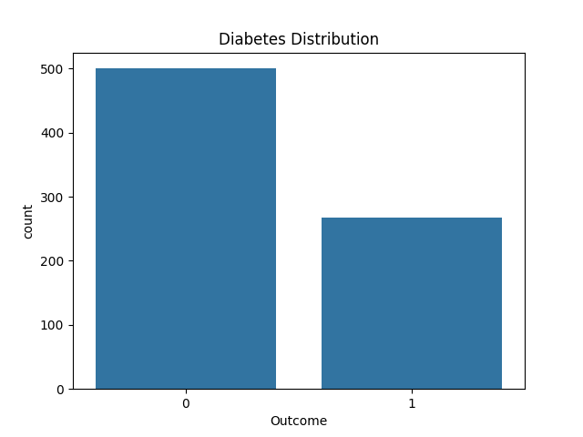
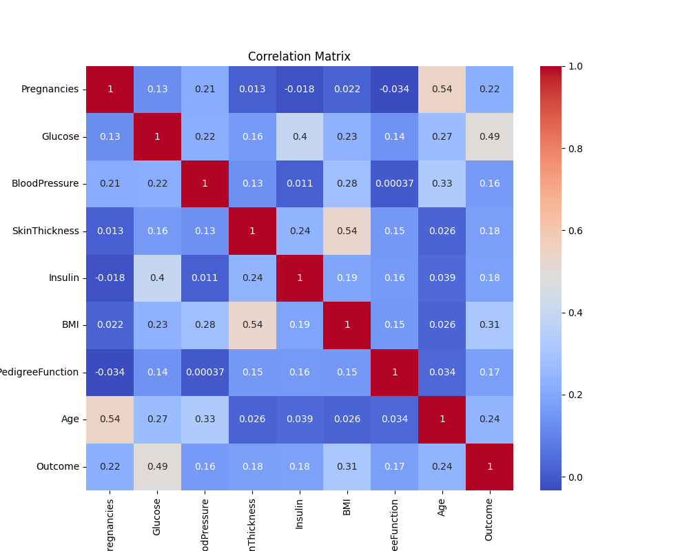
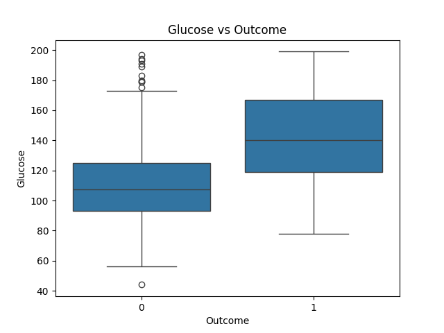
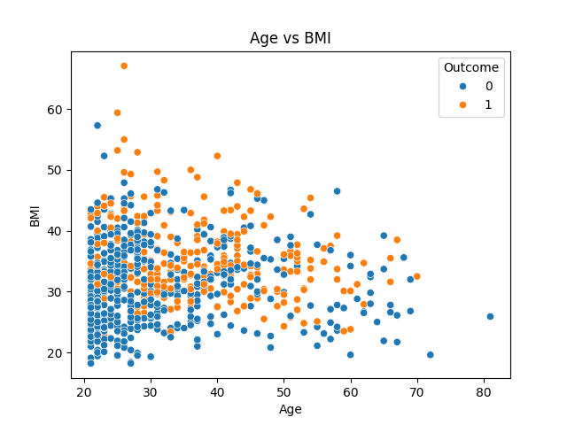
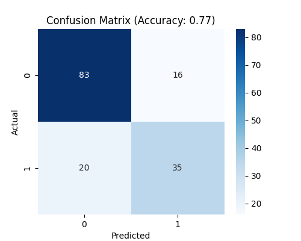

# 🏥 Diyabet Tahminleme: Lojistik Regresyon Projesi

Bu proje, temel sağlık verilerini kullanarak bir kişinin diyabet hastası olup olmadığını tahmin etmek amacıyla geliştirilmiş bir **Lojistik Regresyon (Logistic Regression)** modelini içermektedir.

## 📁 Proje İçeriği

- `diabetes.csv`: Pima Indians Diabetes veri seti.
- `ornek.py`: Veri analizi, önişleme, model eğitimi ve değerlendirme adımlarını içeren ana Python betiği.

## 📊 Veri Seti Hakkında

Veri seti, kadın hastaların biyometrik verilerini içermektedir. Temel özellikler şunlardır:
- **Glucose**: Kandaki glikoz konsantrasyonu.
- **BloodPressure**: Kan basıncı (mmHg).
- **SkinThickness**: Cilt kıvrım kalınlığı (mm).
- **Insulin**: 2 saatlik serum insülini (mu U/ml).
- **BMI**: Vücut Kitle Endeksi (ağırlık kg / (boy m)^2).
- **Age**: Yaş.
- **Outcome**: Diyabet durumu (0: Değil, 1: Diyabet).

## 🛠️ Uygulanan Adımlar

1.  **Veri Temizleme**: Veri setinde bilimsel olarak imkansız olan `0` değerleri (Glikoz, BMI vb.), ilgili sütunların ortalama değerleri ile doldurulmuştur.
2.  **Keşifsel Veri Analizi (EDA)**:
    - Sınıf dağılımı incelendi.
    - Özellikler arası korelasyon matrisi çıkarıldı.
    - Aykırı değerler için Boxplot analizleri yapıldı.
3.  **Veri Önişleme**: 
    - Veriler `StandardScaler` kullanılarak standartlaştırıldı.
    - Veri seti %80 eğitim, %20 test olmak üzere ikiye ayrıldı.
4.  **Model Eğitimi**: Scikit-Learn kütüphanesi kullanılarak `LogisticRegression` modeli eğitildi.
5.  **Değerlendirme**: Modelin performansı **Doğruluk (Accuracy)** skoru ve **Hata Matrisi (Confusion Matrix)** ile ölçüldü.

## 🚀 Başlangıç

Bu projeyi yerel bilgisayarınızda çalıştırmak için aşağıdaki adımları izleyebilirsiniz.

### Gereksinimler

Projenin çalışması için gerekli kütüphaneler:
```bash
pip install pandas numpy matplotlib seaborn scikit-learn
```

### Çalıştırma

```bash
python ornek.py
```

## 📈 Görsel Analizler ve Sonuçlar

Modelin eğitim sürecinde elde edilen görsel analizler aşağıdadır:

### 1. Veri Dağılımı ve İlişkiler
| Sınıf Dağılımı | Korelasyon Matrisi |
| :---: | :---: |
|  |  |

### 2. Özellik Analizi
| Glikoz ve Sonuç İlişkisi | Yaş vs BMI Scatter |
| :---: | :---: |
|  |  |

### 3. Model Performansı
Model, test verileri üzerinde başarılı bir tahminleme performansı sergilemiştir.



---
*Bu çalışma, Makine Öğrenmesi temellerini anlamak ve Lojistik Regresyonun sınıflandırma problemlerindeki başarısını gözlemlemek için hazırlanmıştır.*

