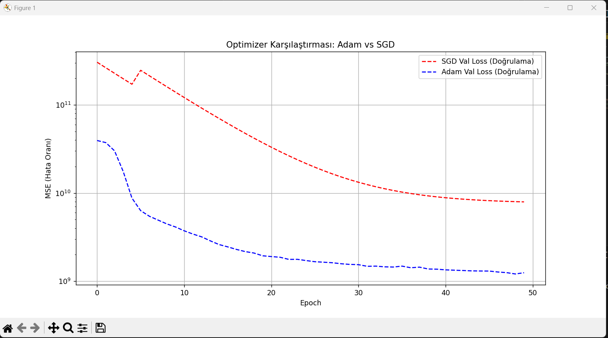
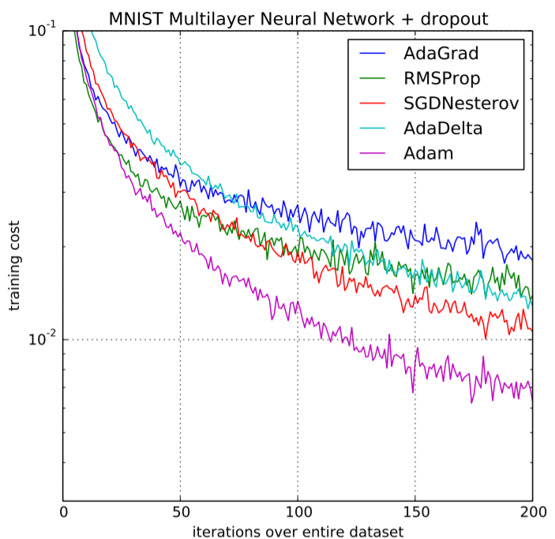

# Optimizer ve Learning Rate (Öğrenme Oranı) İncelemesi

Bu proje, Derin Öğrenme (Deep Learning) alanındaki iki temel kavram olan **Optimizer (Eniyileştirici Algoritmalar)** ve **Learning Rate (Öğrenme Oranı)** kavramlarının etkilerini incelemek için oluşturulmuştur. Bu doğrultuda, bir regresyon problemi (Ev Fiyat Tahmini) üzerinde **SGD (Stochastic Gradient Descent)** ve **Adam** optimizer algoritmaları arasındaki başarı ve hız farklılığı simüle edilmiştir.

## 📁 Proje Dosya Yapısı

Klasörünüzdeki karmaşıklığı gidermek adına dosyalar düzenlenmiş ve daha profesyonel, anlaşılır bir formata getirilmiştir:
- `train.csv`: Model eğitiminde kullanılan bağımsız (X) ve bağımlı (y) değişkenleri içeren veri seti.
- `optimizer_comparison.py` *(eski adıyla `orn.py`)*: SGD ve Adam optimizasyon tekniklerini aynı derin öğrenme mimarisi üzerinde test edip karşılaştıran Python betiği. 
- `optimizer_comparison.png` *(eski adıyla `Ekran görüntüsü 2026-02-26 142411.png`)*: Modelin eğitim süreci neticesinde iki optimizer'ın "Doğrulama Hatası (Validation Loss)" düşüş hızını gösteren karşılaştırma grafiği.
- `performance.png`: Modelin farklı eğitim ve test aşamalarındaki performans metriklerini ve değerlendirmelerini içeren görsel.
- `README.md`: Tüm bu yapıları ve matematiksel denklemleri açıklayan dokümantasyon (şu an okuduğunuz doysa).

---

## 🧠 Konu Başlığı: Optimizer ve Learning Rate Nedir?

Yapay zeka modellerini eğitirken, modelin yaptığı hataları en aza indirmek (Loss değerini minimize etmek) isteriz. Modeli daha başarılı kılmak için ağırlıkların (weights) hangi yönde ve ne boyutta güncelleneceğini belirleyen yöntemlere **Optimizer** (Eniyileştirici) denir. Bu güncellemelerin adım büyüklüğünü kontrol eden ve modelin eğilimini ayarlayan hiperparametreye ise **Learning Rate (Öğrenme Oranı, $\alpha$)** adı verilir.

### 1. Learning Rate (Öğrenme Oranı)
Learning Rate, genellikle $\alpha$ (alfa) ile gösterilir ve $[0, 1]$ aralığında (ancak genellikle $0.001$, $0.01$ gibi çok küçük değerler alan) pozitif bir sayıdır.
- **Çok Büyük Bir $\alpha$:** Model, optimum noktayı (minimum hatayı bulduğumuz noktayı) atlayabilir. Sürekli sekerek kayıp (loss) grafiğinde sapmalara sebep olur.
- **Çok Küçük Bir $\alpha$:** Model çok yavaş öğrenir. Hatta bazen "local minima" dediğimiz lokal çukurlara takılıp kalır ve optimum seviyeye ulaşması çok uzun (epoch) sürer.

**Matematiksel Ağırlık Güncellemesi Kuralı:**
Formülün en temel yapısı şöyledir:
$$ \theta_{yeni} = \theta_{eski} - \alpha \cdot \nabla J(\theta) $$
Burada $\nabla J(\theta)$, hata/kayıp (Loss) fonksiyonunun türevidir (Gradyan). Biz ağırlıklarımızı hatanın tersi yönde, gradyanı baz alarak güncelleriz.

---

### 2. SGD (Stochastic Gradient Descent)
Standart Gradient Descent, hesaplama yapmak için tüm veri setini dikkate alır, bu da devasa veri setlerinde çok maliyetlidir ve yavaştır. SGD ise eğitim verisinden düzenli olarak alınan rastgele örneklemler üzerinden her adımda hemen parametreleri günceller.
Çok daha az hesaplama gücü ister, fakat her bir iterasyondaki gradyan rastgele (stochastic) alındığından rotası çok "gürültülüdür" (inişli çıkışlı).

**Matematiksel İfadesi:**
Her $\theta$ (ağırlık) değeri, rastgele seçilen i. örnek için $x^{(i)}$ girdisi ve $y^{(i)}$ hedefi olmak üzere şöyle güncellenir:
$$ \theta_{t} = \theta_{t-1} - \alpha \cdot \nabla_{\theta} J(\theta_{t-1}; x^{(i)}, y^{(i)}) $$

---

### 3. Adam Optimizer (Adaptive Moment Estimation)
En popüler ve günümüzde en çok varsayılan olarak kabul edilen optimizer yöntemidir. Matematiksel olarak Momentum ve RMSProp optimizasyon algoritmalarının yeteneklerini birleştirir.
Öğrenme oranını (Learning Rate) her bir ağırlık parametresi için duruma göre **bireysel ve dinamik (Adaptive)** olarak ayarlar.

**Matematiksel İfadesi (Çözümlenişi):**
Adam Optimizer, önceki gradyanların ortalama değerlerini (momentum) ve gradyan karesini akılda tutarak hesaplama yapar.

**a.** 1. Moment Tahmini (Mean/Ortalama - Eğimin ne yönde gittiği):  
$$ m_t = \beta_1 m_{t-1} + (1 - \beta_1) g_t $$  
*(Burada $g_t$ güncel gradyan / hata türevidir. $\beta_1$ genelde 0.9'dur)*

**b.** 2. Moment Tahmini (Uncentered Variance/Varyans - Eğimin ne kadar büyük/küçük olduğu):  
$$ v_t = \beta_2 v_{t-1} + (1 - \beta_2) g_t^2 $$  
*(Burada $\beta_2$ genelde 0.999'dur)*

**c.** Başlangıç Düzeltmesi (Bias Correction - Başlangıçtaki sıfıra kayma eğilimini önlemek):  
$$ \hat{m}_t = \frac{m_t}{1 - \beta_1^t}  \quad , \quad \hat{v}_t = \frac{v_t}{1 - \beta_2^t} $$

**d.** Parametrelerin Güncellenmesi Kuralı:  
$$ \theta_t = \theta_{t-1} - \alpha \frac{\hat{m}_t}{\sqrt{\hat{v}_t} + \epsilon} $$  
*Burada $\epsilon$ (epsilon) paydanın sıfır olmasını engellemek için eklenen çok küçük bir sabit (~$10^{-8}$).*

Görüldüğü üzere Adam, gradyan değişiminin yoğun olduğu, karmaşık düzlemlerde hızı dinamik olarak kısıp/açarak çok daha hızlı ve pürüzsüz bir yakınlaşma (convergence) sağlar.

---

## 📈 Sonuçların Görselleştirilmesi ve Analizi

Projedeki `optimizer_comparison.py` betiği ile MSE (Hata Oranı) logaritmik olarak aşağıdaki farklı sonuçlarla incelenmiştir:
* **Mavi Çizgi (Adam):** Adam, hata oranını (Val Loss) ilk epoch'lardan itibaren **çok agresif ve hızlı** bir şekilde düşürmüştür. Momentum ve RMSProp mimarisinin getirdiği dinamik öğrenme yeteneği sayesinde minimum hataya kolayca ulaşır. 
* **Kırmızı Çizgi (SGD):** SGD, mavi çizgiye kıyasla daha çok sabit/yatay bir eğilim göstermektedir veya daha nazlı bir hızla düşmektedir. Çözüm uzayında bir yöne kararlı gitmez ve yavaşlığı onu geride sıklıkla bırakır. Sabit veriler üzerinde parametrelerini stabilize etmesi daha çok epoch sayısına gereksinim duyar.

`optimizer_comparison.py` çalıştırılarak hata düşüş loglarına ve bu grafiğin güncel haline ulaşabilirsiniz.

### 📊 Performans Değerlendirmesi

Algoritmaların hata (Loss) azaltma hızlarının yanı sıra genel performanslarının analizi aşağıda yer almaktadır:

Bu görsel, modellerin tahmin yeteneklerinin ve genel hata/başarı metriklerinin birbirlerine kıyasla nasıl şekillendiğini desteklemek amacıyla verilmiştir.
