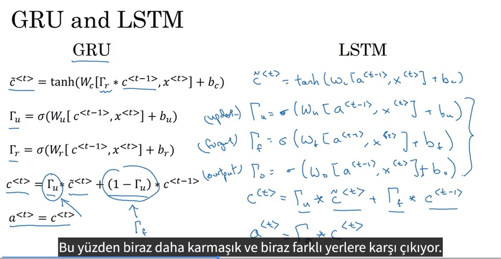

# 🧠 TensorFlow Öğrenme Yolculuğu

Bu depo, TensorFlow ve Derin Öğrenme dünyasına attığım adımları, temel işlemlerden modern mimarilere kadar uzanan bir yelpazede içeren kapsamlı bir çalışma alanıdır.

---

## 📂 Proje Yapısı ve Görsel Rehber

Dizin, öğrenme sürecini takip eden mantıksal bir sıra ile düzenlenmiştir:

### 1️⃣ [01-Temel-Islemler](./01-Temel-Islemler/) - Temeller
TensorFlow'un çekirdek mantığı ve temel makine öğrenmesi algoritmaları.
- `01-Temel-Islemler.py`: Tensör manipülasyonları.
- `02-Lineer-Regresyon.py`: Keras Sequential API ile ilk regresyon modeli.

### 2️⃣ [02-Regresyon-Projeleri](./02-Regresyon-Projeleri/) - Veri Analizi ve Tahmin
Gerçek dünya verileri üzerinde uçtan uca regresyon çalışmaları.
- `02-Mercedes-Fiyat-Tahmini.py`: Kapsamlı veri temizleme, görselleştirme ve fiyat tahminleme projesi.

### 3️⃣ [03-Derin-Ogrenme-Mimarileri](./03-Derin-Ogrenme-Mimarileri/) - Modern Mimariler

#### 🔄 Yinelemeli Sinir Ağları (RNN)
Zaman serileri ve diziler için tasarlanmış yapılardır.
- `02-RNN-Sayi-Tahmini.py`: RNN katmanları ile sayı dizisi tahmini.

| RNN Tipleri | RNN Hücresi |
| :---: | :---: |
|  |  |

> **RNN Gelişmiş Mimarileri:** Vanishing gradient problemine çözüm olarak geliştirilen **GRU** ve **LSTM** yapılarını aşağıda görebilirsiniz.

| GRU Mimarisi | LSTM Mimarisi |
| :---: | :---: |
|  |  |

| GRU vs LSTM Karşılaştırması | Çift Yönlü (Bidirectional) RNN |
| :---: | :---: |
|  |  |

---

#### ⚡ Transformer ve Attention Mekanizması
Modern NLP (Doğal Dil İşleme) dünyasının kralı olan Transformer yapısı.
- `03-Transformer-Mimarisi.py`: Multi-Head Attention mekanizması uygulaması.

> **Self-Attention:** Cümledeki her kelimenin diğer tüm kelimelerle olan ilişkisini anlamasını sağlar.


| Multi-Head Attention | Tam Transformer Mimarisi |
| :---: | :---: |
|  |  |

---

## 🛠️ Nasıl Çalıştırılır?

1. Gerekli kütüphaneleri yükleyin:
   ```bash
   pip install -r requirements.txt
   ```
2. İlgili klasöre gidip Python dosyasını çalıştırın:
   ```bash
   python 03-Derin-Ogrenme-Mimarileri/03-Transformer-Mimarisi.py
   ```

---
*Geliştirmeye ve öğrenmeye devam...* 🚀
