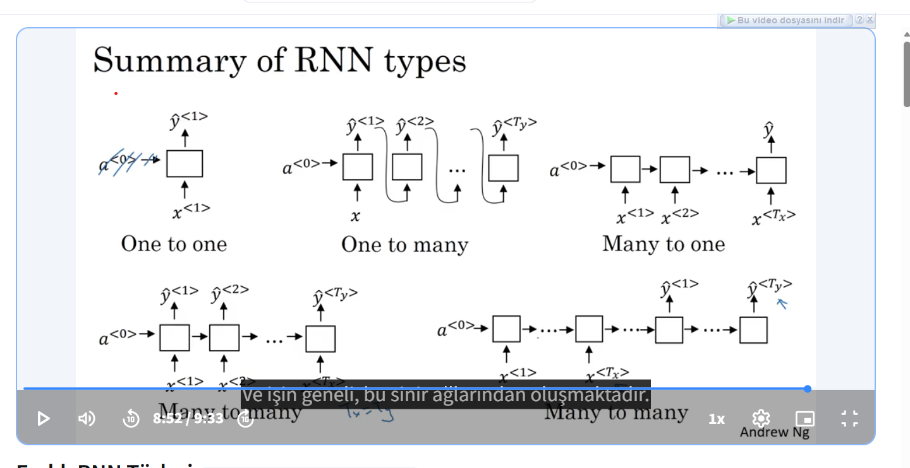
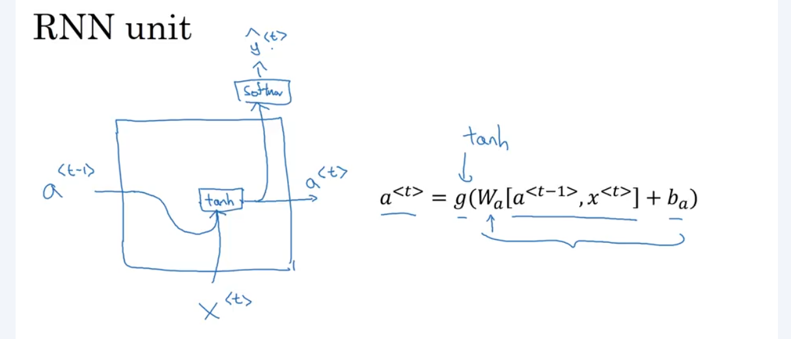
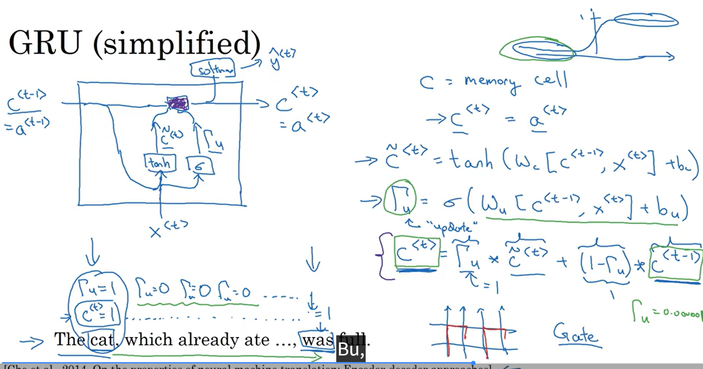
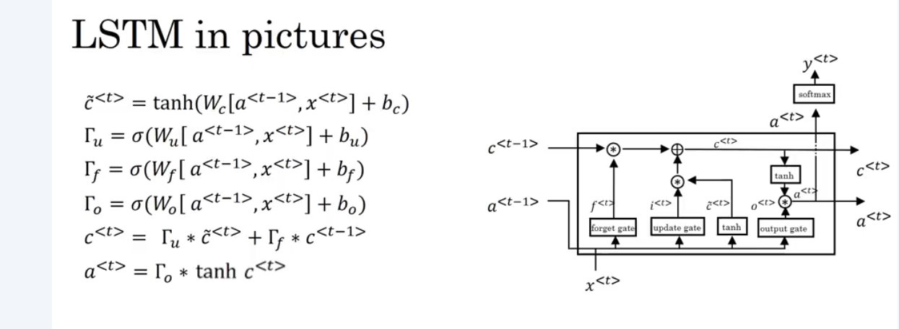
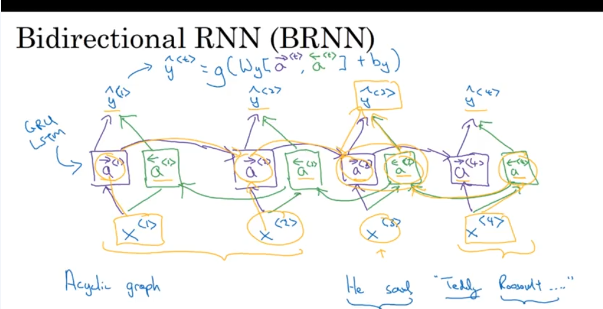
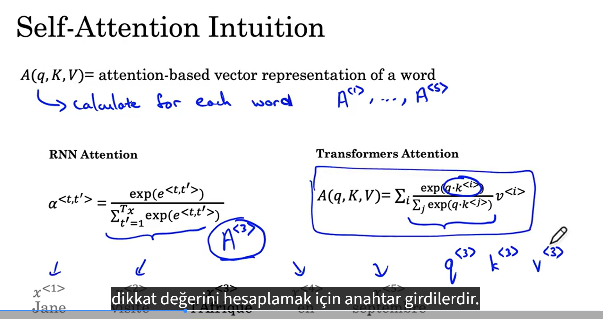
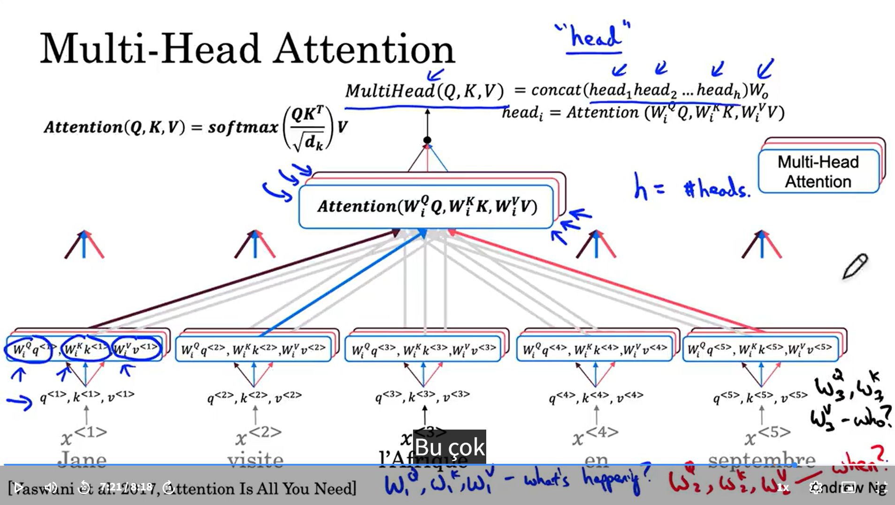

# 🧠 TensorFlow & Deep Learning Playground

Bu depo, TensorFlow ve Derin Öğrenme dünyasına attığım adımları, temel işlemlerden en modern mimarilere kadar uzanan bir yelpazede içeren kapsamlı bir çalışma alanıdır.

---

## 🗺️ İçindekiler

1.  [**01-Temel-İşlemler**](./01-Temel-Islemler/): TensorFlow temelleri ve basit regresyonlar.
2.  [**02-Regresyon-Projeleri**](./02-Regresyon-Projeleri/): Gerçek dünya fiyat tahminleme projeleri.
3.  [**03-Derin-Öğrenme-Mimarileri**](./03-Derin-Ogrenme-Mimarileri/): CNN, RNN, GNN ve Transformer uygulamaları.
4.  [**Logistic Regresyon Projesi**](./Logistic_regresyon/): Diyabet tahminleme vaka çalışması.
5.  [**Kedi-Köpek Sınıflandırma**](./Cat-Dog-TensorFlow-Project/): Büyük veri seti ile görüntü işleme projesi.

---

## 🚀 Öne Çıkan Projeler

### 🐾 [Kedi mi Köpek mi?](./Cat-Dog-TensorFlow-Project/)
CNN mimarisi kullanarak binlerce görüntü üzerinden yüksek doğrulukla hayvan sınıflandırması yapan kapsamlı bir proje.

### 🏥 [Lojistik Regresyon ile Diyabet Tahmini](./Logistic_regresyon/)
Sağlık verilerini analiz eden, veri temizleme ve görselleştirme adımlarını içeren profesyonel bir sınıflandırma örneği.

---

## 📂 Görsel Mimari Notları

Dizinde teorik bilgileri desteklemek için görsel notlar bulunmaktadır:

### 🔄 Yinelemeli Sinir Ağları (RNN)
| RNN Tipleri | RNN Hücresi |
| :---: | :---: |
|  |  |

> **RNN Gelişmiş Mimarileri:** Vanishing gradient problemine çözüm olan **GRU** ve **LSTM** yapıları.

| GRU Mimarisi | LSTM Mimarisi | Çift Yönlü RNN |
| :---: | :---: | :---: |
|  |  |  |

---

### ⚡ Transformer ve Attention Mekanizması
Modern NLP dünyasının kalbi olan Transformer yapısı.

| Self-Attention Sezgisi | Multi-Head Attention |
| :---: | :---: |
|  |  |

---

## 🛠️ Kurulum ve Çalıştırma

1.  Repoyu klonlayın ve klasöre girin.
2.  Gerekli kütüphaneleri yükleyin:
    ```bash
    pip install -r requirements.txt
    ```
3.  İstediğiniz projenin klasörüne gidip ilgili Python dosyasını çalıştırın:
    ```bash
    python 03-Derin-Ogrenme-Mimarileri/03-Transformer-Mimarisi.py
    ```

---
*Bu çalışma, Makine Öğrenmesi ve Derin Öğrenme yolculuğumda edindiğim tecrübelerin bir yansımasıdır.* 🚀

