# 🫀 Kalp Hastalığı Tahmini ve Derin Öğrenmede Regularization (Düzenlileştirme) Analizi

Bu proje, bir veri seti üzerinden kalp hastalığı riskini tahmin etmek üzere geliştirilmiş kapsamlı bir **Derin Öğrenme (Deep Learning)** çalışmasıdır. Projenin asıl odak noktası, yapay sinir ağlarında sıkça karşılaşılan **aşırı öğrenme (overfitting)** problemini engellemek için sinir ağlarında farklı seviyelerde **Regularization (Düzenlileştirme)** ve **Dropout** tekniklerinin nasıl çalıştığını analiz etmektir. 

Python programlama dili kullanılarak (TensorFlow, Keras, Pandas, Seaborn vb. kütüphaneler ile) kodlanmış, veriler görselleştirilmiş ve elde edilen model sonuçları detaylıca incelenmiştir.

---

## 📌 Projenin Amacı

Yapay sinir ağları karmaşık problemleri çözmede çok başarılı olsalar da, eğitim verisine çok fazla odaklanıp ezber yapma eğilimindedirler (Overfitting). Bu projede:
- Veri setindeki hastalık ilişkilerini anlamak için **Keşifçi Veri Analizi (EDA)** yapılmış,
- Sinir ağlarının ezberlemesini önlemek amacıyla ağırlık cezalandırması **(L2 Regularization)** uygulanmış,
- Nöronların rastgele kapatılması **(Dropout)** tekniği test edilmiş,
- Farklı ceza seviyelerinin (Hafif, Sert ve Optimum) modelin öğrenme kapasitesi üzerindeki etkileri karşılaştırılmıştır.

---

## 📊 1. Keşifçi Veri Analizi (EDA)

Veriler üzerinde bir sinir ağı eğitmeye başlamadan önce, verilerin dağılımını, dengesini ve özellikler arasındaki ilişkileri anlamak için Pandas, Seaborn ve Matplotlib kullanılarak veri temizleme ve analiz adımları gerçekleştirilmiştir.

### 🔹 Kalp Hastalığı Dağılımı ve Korelasyon Matrisi
Veri setindeki kalp hastalığı geçirenlerle geçirmeyenlerin (hedef değişken) arasındaki dağılım ilk olarak incelenmiştir. Sınıf dengesizliği olup olmadığı tespit edilmiştir. Ardından, özellikler arasındaki tüm çoklu ilişkiler Pearson Korelasyon Matrisi ve ısı haritası kullanılarak ortaya çıkartılmıştır.

  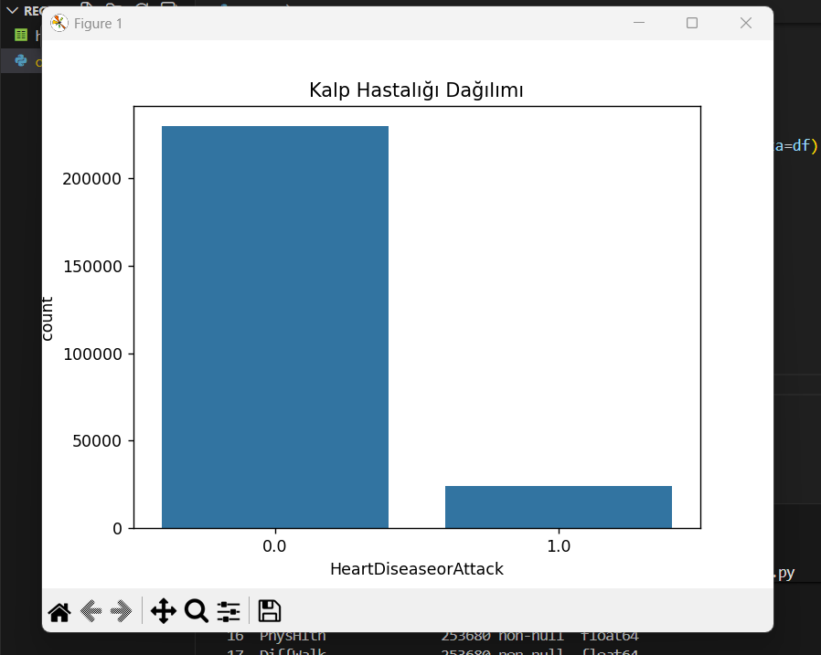
  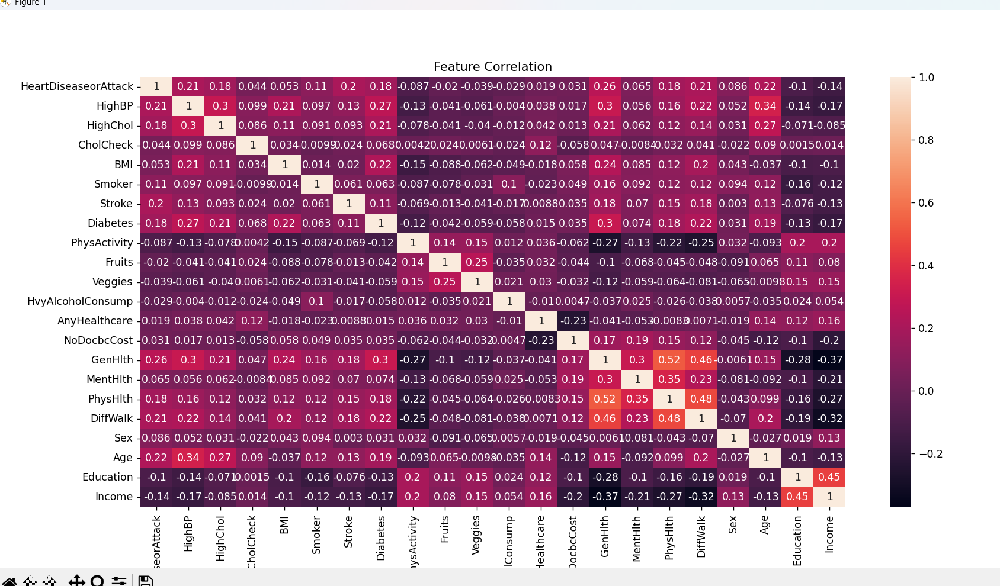

### 🔹 Vücut Kitle İndeksi (BMI) Dağılımı
Hastaların Vücut Kitle İndeksi (BMI) veri seti içerisindeki en önemli bağımsız değişkenlerden biridir. Histogram grafiği kullanılarak veri kümesindeki bireylerin BMI değerlerinin nasıl kümülendiği (normal dağılıma yakınlığı vs.) görülmektedir.
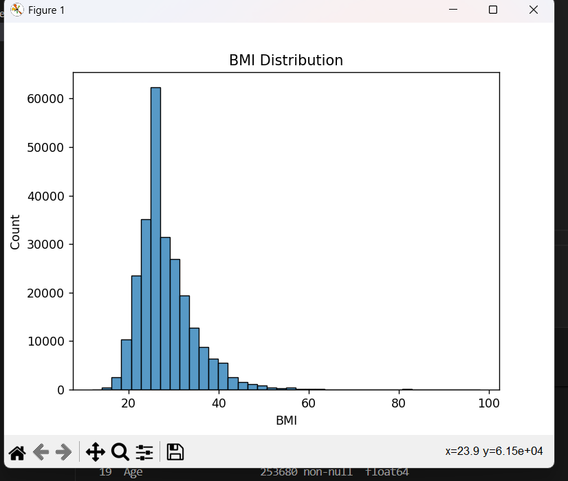

### 🔹 Yaş Dağılımı ve Kalp Hastalığı ile İlişkisi
Hastaların genel yaş dağılımı 13 farklı kategoriyle (solda) ifade edilmiş ve hastalıkla ilişkisi doğrudan bir Kutu Grafiği (Boxplot) aracılığıyla gösterilmiştir (sağda). İki grafik birleştiğinde, yaş arttıkça kalp hastalığı veya kalp krizi riskinin bariz bir şekilde yükseldiği görülmektedir.

  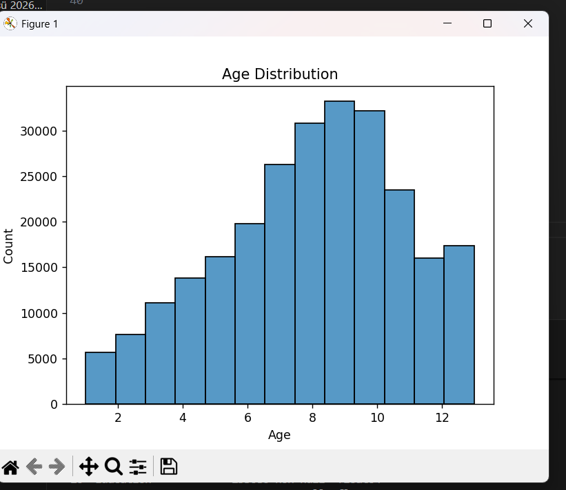
  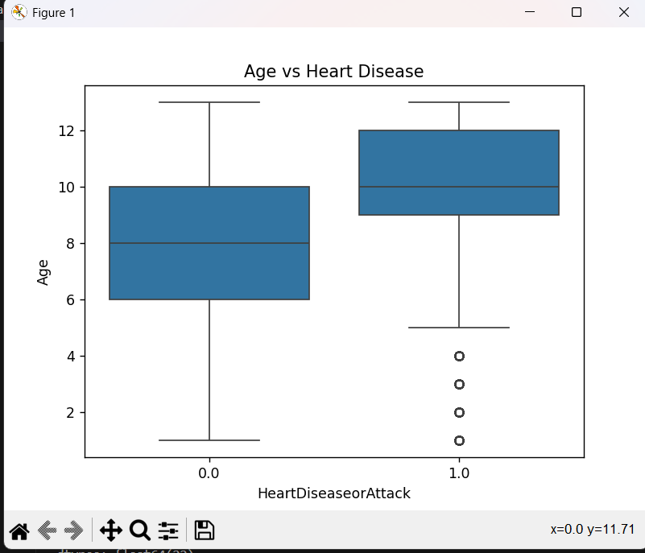

### 🔹 Yüksek Tansiyon Etkisi ve Özelliklerin Önemi (Feature Importance)
Tansiyonun (HighBP) kalp hastalığı ile ilişkisini Countplot ile incelediğimizde, tansiyon hastası olan kişilerin bariz bir şekilde daha yüksek kalp riski taşıdığı gözlemlenmiştir. Ardından tüm özellikler, hedef değişkene (HeartDiseaseorAttack) olan etkilerine göre sıralanmış ve bir Bar Grafiği olarak sunulmuştur.

  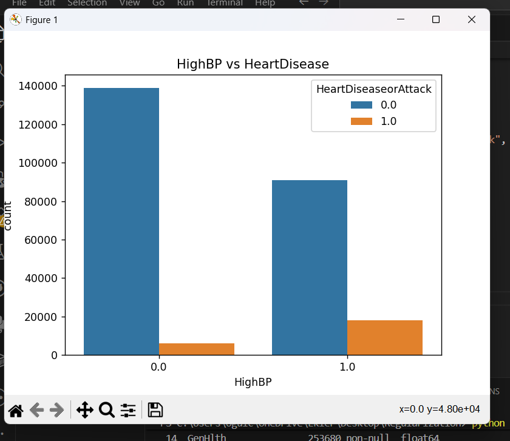
  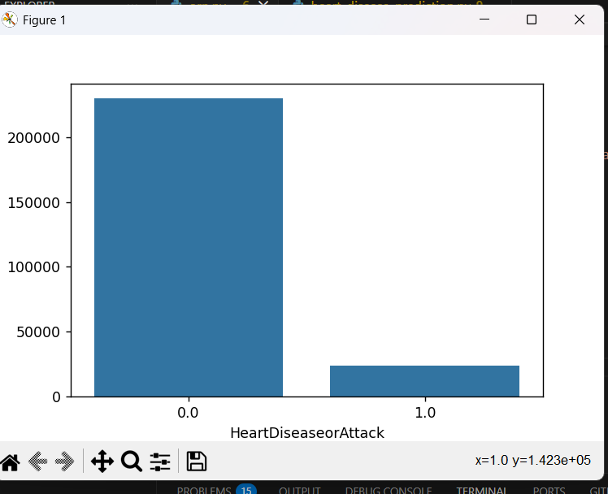

---

## 🛠 2. Veri Ön İşleme (Preprocessing)

Derin Öğrenme modelleri verilerin ölçeğine karşı son derece hassastır. Verilerden maksimum verim alabilmek için aşağıdaki veri ön işleme adımları uygulanmıştır:
1. **Verinin Bölünmesi (Train-Test Split):** Veri seti, aşırı öğrenmeyi test edebilmek için %80 Eğitim (Train) ve %20 Test (Test) seti olarak ikiye ayrılmıştır. Ayrıca eğitim esnasında da %20'lik bir Validation (Doğrulama) alt seti kullanılmıştır.
2. **Normalizasyon (StandardScaler):** Farklı birimlerde olan verilerin (Örn: BMI 25 iken, Yaş kategorisi 10 vs.) sinir ağı ağırlıklarını (weights) dengesiz etkilemesini önlemek adına tüm girdiler `StandardScaler` ile standartlaştırılmış, yani ortalaması 0 ve standart sapması 1 olacak şekilde ölçeklendirilmiştir.

---

## 🧠 3. Sinir Ağı Mimarisi ve Regularization Stratejileri

Aşırı öğrenmeyi (overfitting) farklı tekniklerle nasıl engelleyeceğimizi görmek için 3 ayrı model senaryosu kurgulanmıştır.

### 🟡 Model A: Temel Regularization Modeli (Hafif/Orta Ceza)
İlk modelimizde ağın temel ağırlık büyümelerini frenlemek için **L2 Regularization** ve ezberlemeyi önlemek için nispeten düşük ayarlı bir **Dropout** kullanılmıştır:
- **Gizli Katman 1:** 64 Nöron `(ReLU Aktivasoynu)` + `L2=0.01` + `Dropout=0.30`
- **Gizli Katman 2:** 32 Nöron `(ReLU Aktivasoynu)` + `L2=0.01` + `Dropout=0.20`
- **Çıkış Katmanı:** 1 Nöron `(Sigmoid Aktivasyonu)`
- 30 Epoch ve Adam Optimizer ile çalıştırılmıştır.

Model eğitiminde, Training ve Validation kayıp (loss) değerleri birbiriyle tutarlı azalmaktadır.
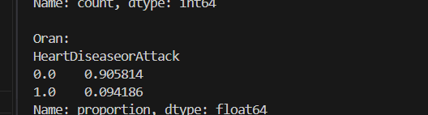

  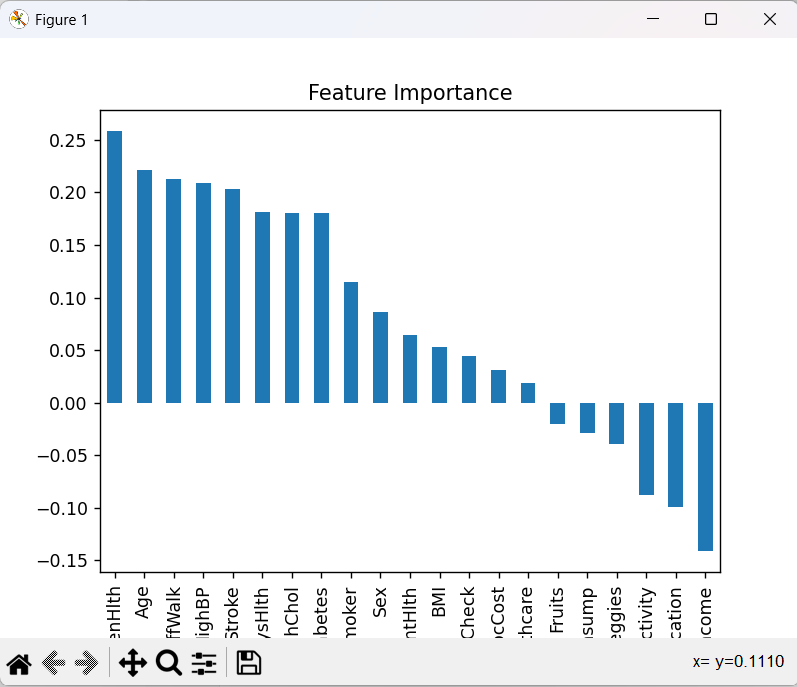
  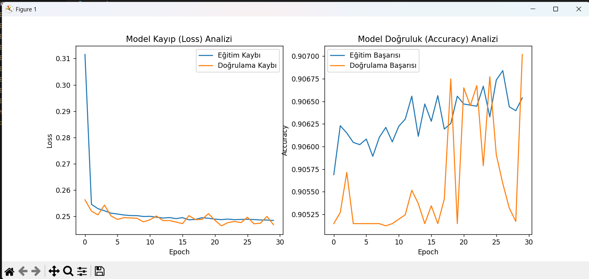

### 🔴 Model B: Sert Regularization Modeli (Sıkı Ceza)
İkinci aşamada sinir ağına öğrenmesi için **çok daha sert cezalar** verilmiştir. Ağırlıkları minimumda tutmak için L2 değeri 10 kat artırılmış ve her adımda nöronların yarısı rastgele kapatılmıştır:
- **Gizli Katman 1:** `L2=0.1` + `Dropout=0.50`
- **Gizli Katman 2:** `L2=0.1` + `Dropout=0.50`
> **Not:** *Aşırı ve sert ceza oranları, modelin ezber yapmasını tamamen önlerken (Underfitting riski taşır), aynı zamanda ağın sağlıklı verileri öğrenmesine de köstek olabilir. Kayıp ve Accuracy grafiklerinden modelin öğrenme zorlukları çektiği görülebilmektedir.*
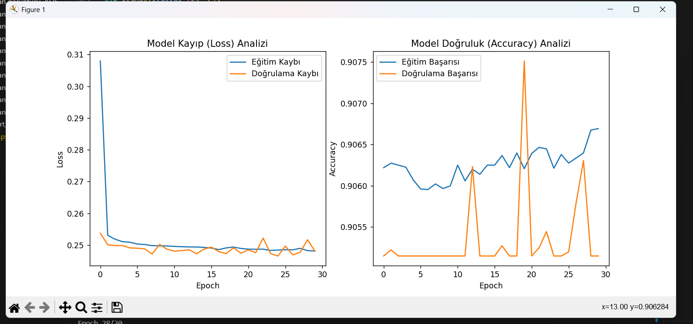

### 🟢 Model C: Optimum (Dengeli) Regularization Modeli
Son deneyde iki tarafın da en iyi özellikleri (hem modeli zapt etme hem de kapasitesinden yararlanma) bir araya getirilmiştir:
- **Düzenlemeler:** Ceza seviyesi oldukça makul seviyeye çekilmiş (`L2=0.005`, `Dropout=0.2`).
- **Öğrenme Hızı (Learning Rate):** Model daha yavaş, emin ve sarsıntısız adımlarla ilerlesin diye Adam optimizer'ın standart `0.001` olan hızı, yarı yarıya düşünülerek `0.0005`'e çekilmiştir.
- **Epoch:** Yavaş öğrenme telafi edilsin diye eğitim adım sayısı 50'ye yükseltilmiştir.

  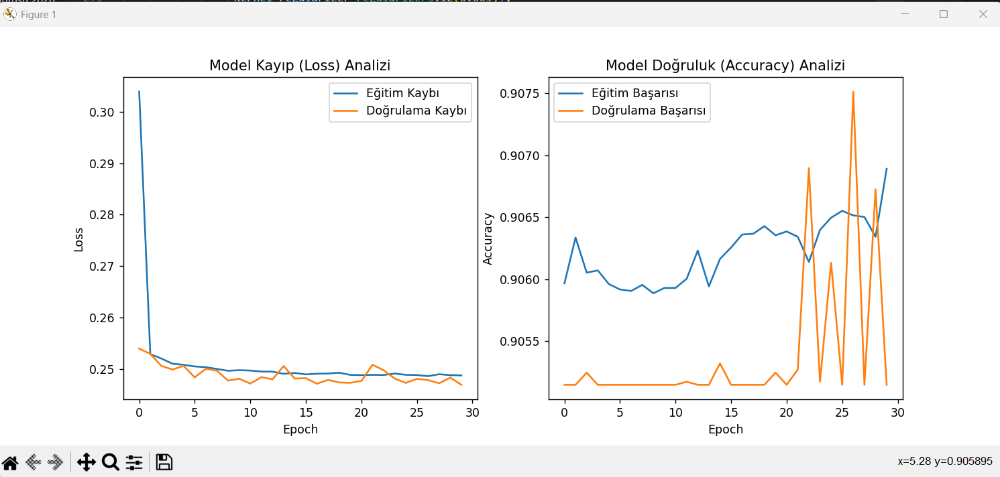
  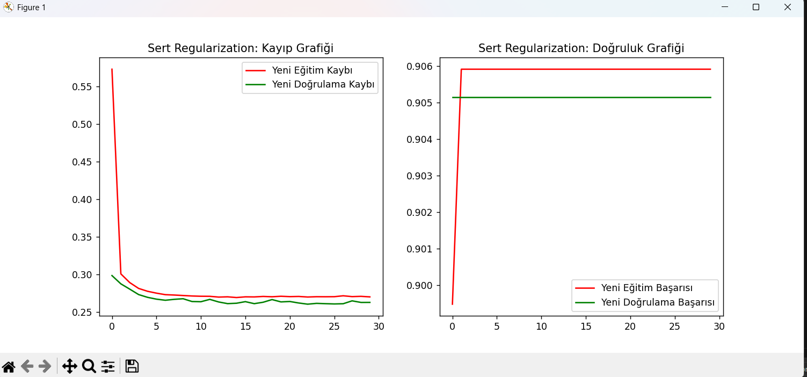

---

## 🎯 Proje Sonucu ve Ana Çıkarımlar
1. **Derin Öğrenmede Ölçeklendirme:** Ağırlıkların hızlı ve stabil bir şekilde güncellenmesi için `StandardScaler` vazgeçilmez bir ön işleme taktiğidir.
2. **Regularization'ın Önemi:** Eğer **L2 Regularization** ve **Dropout** teknikleri olmasaydı, model eğitim veri setini %100 doğruluğa kadar ezberleyip, daha önce görmediği yepyeni hastalarda çok büyük hatalar yapacaktı.
3. **Hiperparametre Dengesi:** *Model B (Sert Ceza)* testinden de gördüğümüz üzere fazla baskılayıcı bir ceza sistemi kurmak, modelin basit desenleri (patternleri) dahi öğrenmesini engeller. Bu nedenle *Model C ('Optimum' Dengeli Ceza)* gibi ince ayar yapmak son derece önemlidir.
4. Yüksek tansiyon, ileri yaş ve BMI yüksekliği, kurduğumuz algoritmalar neticesinde kalp hastalığını tetikleyen birincil faktörler olarak doğrulanmıştır.
