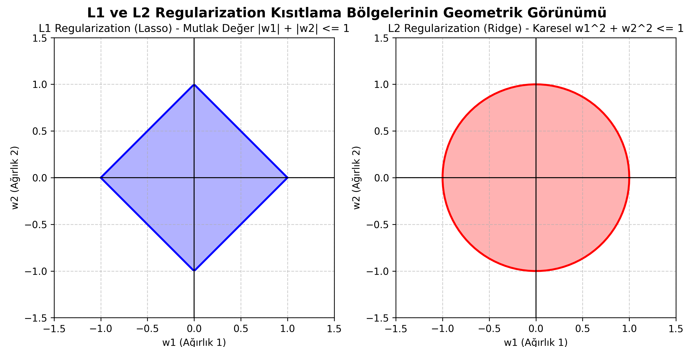

# REGULARIZATION (DÜZENLİLEŞTİRME) NEDİR?

Yapay zeka ve makine öğrenmesi modelleri eğitilirken karşılaşılan en büyük problem **"Overfitting"** yani "Aşırı Öğrenme/Ezberleme" problemidir. Model, eğitim verisini o kadar iyi öğrenir ki (adeta ezberler), daha önce hiç görmediği yeni veriler (test verisi veya gerçek hayat verisi) ile karşılaştığında ne yapacağını bilemez ve hatalı tahminler üretir.

İşte **Regularization (Düzenlileştirme)**, bu ezberleme problemini engellemek için kullanılan, modelin Kayıp (Loss) fonksiyonuna ekstra bir "ceza terimi" ekleyerek ağı daha basit ve genelleyici olmaya zorlayan matematiksel tekniklerin genel adıdır.

---

## 📌 Genel Formül Yapısı

Makine öğrenmesinde hedefimiz `J(w)` (Maliyet/Kayıp Fonksiyonu) değerini en aza indirmektir. Normal bir modelin formülü şöyledir:

$$ J(w) = \frac{1}{m} \sum_{i=1}^{m} L(y_i, \hat{y}_i) $$

**Regularization eklediğimizde ise formül şu şekli alır:**

$$ J_{reg}(w) = \text{Orijinal Kayıp (Loss)} + \lambda \times \text{Ceza Terimi} $$

Burada **$\lambda$ (Lambda veya Alpha)** bizim cezanın şiddetini belirlediğimiz **Hiperparametredir**. Lambda ne kadar büyük olursa ceza o kadar ağır olur (Sizin projenizin `0.1` veya `0.01` olarak belirlediği L2 katsayısı). 

---

## 📐 1. L1 Regularization (Lasso Regression)

L1 düzenlileştirme, hata fonksiyonuna ağırlıkların (weights) **mutlak değerlerinin toplamını** ceza olarak ekler.

### Matematiksel Formülü:
$$ J(w) = \frac{1}{m} \sum_{i=1}^{m} L(y_i, \hat{y}_i) + \lambda \sum_{j=1}^{n} |w_j| $$

* **Özelliği:** Matematiksel doğası gereği, modeldeki gereksiz veya az öneme sahip parametrelerin/ağırlıkların (weights) doğrudan **SIFIR ($w=0$)** olmasını sağlar. Böylece, gereksiz özellikleri tamamen devreden çıkarır ve yerleşik bir **Özellik Seçimi (Feature Selection)** yapar.

---

## 📐 2. L2 Regularization (Ridge Regression)

L2 düzenlileştirme, hata fonksiyonuna ağırlıkların **karelerinin toplamını** ceza olarak ekler. Deep Learning'de sıkça kullanılır (sizin projenizde de bu kullanıldı: `kernel_regularizer=regularizers.l2()`).

### Matematiksel Formülü:
$$ J(w) = \frac{1}{m} \sum_{i=1}^{m} L(y_i, \hat{y}_i) + \lambda \sum_{j=1}^{n} w_j^2 $$

* **Özelliği:** Ağırlıkları asla tam sıfır yapmaz ama **sıfıra çok yaklaştırır**. Böylece hiçbir özellik tamamen yok sayılmaz ama özellikleri aşırı derecede baskın olan (hızlı büyüyen) parametreler törpülenerek, ezberleme yeteneği elinden alınır.

---

## 🎨 L1 ve L2'nin Geometrik Gösterimi (Grafik)

Aşağıdaki grafik L1 (Lasso) ve L2 (Ridge) yöntemlerinin uzaydaki kısıtlama bölgelerini göstermektedir.
 L1'in elmas (kare) şekli köşeli olduğu için eksenleri kestiği noktalarda ağırlıkların biri sıfırlanma (0) eğilimindedir. L2'nin dairesel yapısı ise tüm ağırlıkları eşit oranda sıkıştırır, ama hiçbir zaman köşeye (sıfıra) oturtmaz.

---

## ⚖️ Diğer Regularization Teknikleri

### 3. Elastic Net Formülü
L1 ve L2 yöntemlerinin karışımıdır. İki yöntemin de avantajlarını bir araya getirerek formüle edilir:

$$ J(w) = \text{Loss} + \lambda_1 \sum_{j=1}^{n} |w_j| + \lambda_2 \sum_{j=1}^{n} w_j^2 $$

### 4. Dropout (Derin Öğrenmeye Özel)
Sinir ağlarında (Neural Networks) eğitim sırasında rastgele belirlenen bir yüzde oranında (örneğin `%30`) bazı nöronları geçici olarak **devreden çıkararak (kapatarak)** uygulanır.
* **Mantığı:** Ağdaki hiçbir nöron bir diğerine kesin olarak güvenemez, bu yüzden işin kolayına kaçıp veri özelliklerini ezberleyemez. Her nöron daha bağımsız çalışmak zorunda kalarak sağlıklı özellikler öğrenir. (Kodunuzdaki `layers.Dropout(0.3)` satırı)

## 🎯 Özet
Regularization, çok iyi çalışan ancak kendi ezberlediği ortamın dışına (örneğin Test setine veya hastaneye gelen yeni bir hastaya) çıktığında çuvallayan bir öğrenciyi, gereksiz ayrıntılara boğulmaktan kurtarıp "işin mantığını kavraması" için uyanık tutan bir ceza & denetim sistemidir.
